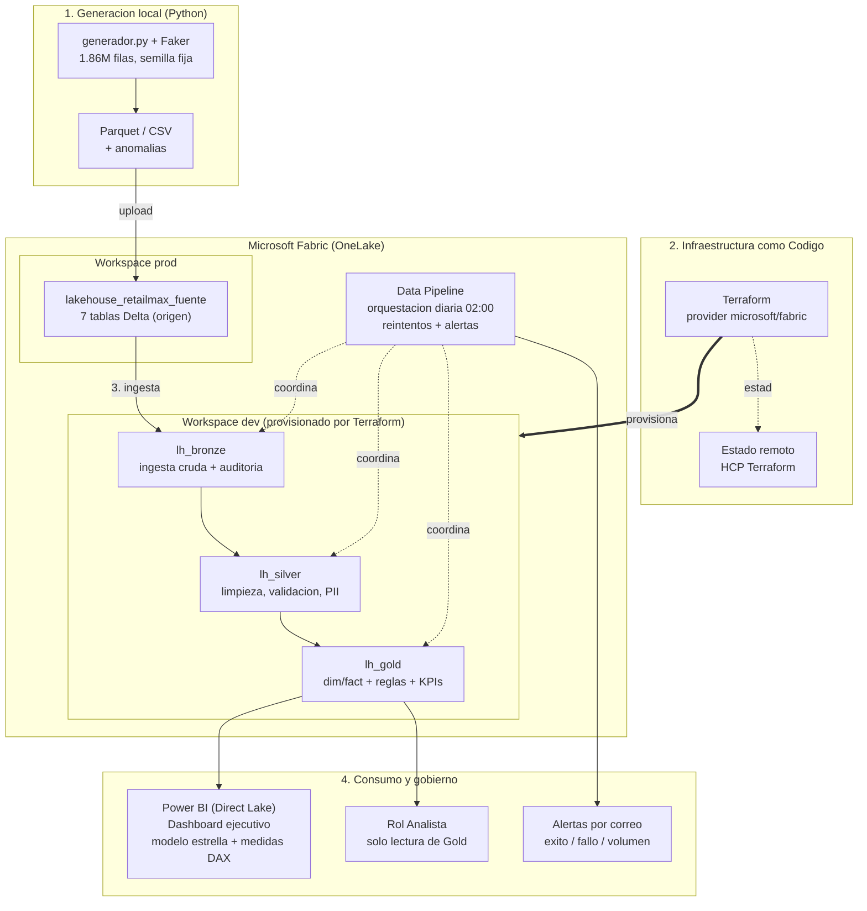

# Arquitectura de la solucion

Diagrama de extremo a extremo: desde la generacion de datos hasta el consumo
analitico, sobre Microsoft Fabric.

## Flujo en palabras

1. **Generacion (local):** `generador.py` crea datos sinteticos reproducibles con
   distribuciones realistas y anomalias controladas; exporta a Parquet/CSV.
2. **Infraestructura (Terraform):** provisiona el workspace dev y los lakehouses
   Medallion; el estado vive en un backend remoto, nunca en el repositorio.
3. **Medallion (PySpark en Fabric):**
   - **Bronze** ingesta la fuente sin transformar, con auditoria e idempotencia.
   - **Silver** deduplica, valida integridad, enmascara PII y reporta calidad.
   - **Gold** aplica las reglas de negocio y construye el modelo dimensional y los KPIs.
4. **Orquestacion:** un Data Pipeline encadena las capas con dependencias,
   reintentos y notificaciones, programado a las 02:00.
5. **Consumo y gobierno:** Gold alimenta un modelo semantico en Direct Lake sobre el
   que se construye el dashboard ejecutivo en Power BI (KPIs, comparativo vs el mismo
   dia de la semana anterior, top 10 por categoria y tasa de descuento); el rol
   Analista accede solo a Gold (minimo privilegio); las alertas llegan por correo.

## Decisiones de arquitectura destacadas

- **Dos workspaces:** prod (fuente con datos) y dev (Medallion, provisionado por
  IaC). Bronze lee la fuente entre workspaces (lectura cross-workspace), el resto
  fluye dentro de dev. Esto separa el origen operacional del entorno analitico.
- **Delta Lake** en todas las capas: transacciones ACID, MERGE para idempotencia
  e historial de versiones.
- **Lectura cross-workspace** solo en la ingesta (Bronze), que es el unico punto
  que toca el sistema de origen.
