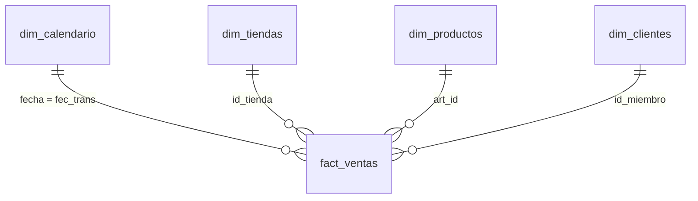

# Dashboard ejecutivo — Diseño (capa de consumo)

Diseño del informe de Power BI para la dirección comercial: vista de ventas
diarias consolidada por país, tienda, canal y categoría, con comparativo vs el
mismo día de la semana anterior, top 10 de artículos por categoría y tasa de
descuento promedio.

Es la capa de consumo del pipeline: se alimenta de la capa Gold del Lakehouse
mediante un modelo semántico en modo **Direct Lake**.

---

## 1. Propósito y audiencia

| Aspecto | Detalle |
|---|---|
| Audiencia | Dirección comercial (vista ejecutiva, lectura diaria) |
| Frecuencia | Diaria; se refresca tras la corrida del pipeline a las 02:00 |
| Origen | Lakehouse `lh_gold` (capa Gold, tablas Delta) |
| Herramienta | Power BI integrado en Fabric |
| Conexión | Modelo semántico en **Direct Lake** (lee Delta de OneLake sin copiar datos) |

**Por qué Direct Lake:** Power BI lee directamente los archivos Delta de la capa
Gold en OneLake, con el rendimiento de un modelo importado pero sin duplicar los
datos ni programar refrescos. Cuando el pipeline actualiza Gold, el informe ve los
datos nuevos automáticamente.

---

## 2. Modelo semántico — esquema estrella

Una tabla de hechos (`fact_ventas`) rodeada de dimensiones. Las comparaciones por
país, canal, categoría y fecha se resuelven por las **relaciones**, no por joins
pre-calculados.



### Relaciones

| Desde (dimensión) | Hacia (hecho) | Cardinalidad | Dirección de filtro |
|---|---|---|---|
| `dim_calendario[fecha]` | `fact_ventas[fec_trans]` | 1 → * | Simple (dim → hecho) |
| `dim_tiendas[id_tienda]` | `fact_ventas[id_tienda]` | 1 → * | Simple |
| `dim_productos[art_id]` | `fact_ventas[art_id]` | 1 → * | Simple |
| `dim_clientes[id_miembro]` | `fact_ventas[id_miembro]` | 1 → * | Simple |

Notas:
- El **país** proviene de `dim_tiendas[id_pais]`; la **categoría** de
  `dim_productos[categoria_n1]`; el **canal** vive en el propio hecho
  (`fact_ventas[canal_venta]`) y se usa como atributo (no requiere dimensión).
- Las ventas anónimas (`id_miembro` nulo) no relacionan con `dim_clientes`; es
  esperado y no afecta los totales de venta.

---

## 3. Dimensión de calendario (`dim_calendario`)

El comparativo "mismo día de la semana anterior" se resuelve con inteligencia de
tiempo en DAX, que **exige una tabla de fechas continua** (sin huecos) marcada
como tabla de fechas. La capa Gold no la tiene aún, así que se añade.

Script PySpark (notebook `pipelines/gold/03_dim_calendario.py`, capa Gold):

```python
from pyspark.sql import functions as F

# Rango que cubra todas las ventas, sin huecos.
r = fact_ventas.agg(F.min("fec_trans").alias("ini"),
                    F.max("fec_trans").alias("fin")).collect()[0]

fechas = spark.sql(
    f"SELECT explode(sequence(to_date('{r.ini}'), to_date('{r.fin}'),"
    f" interval 1 day)) AS fecha")

dim_calendario = (fechas
    .withColumn("anio",          F.year("fecha"))
    .withColumn("trimestre",     F.quarter("fecha"))
    .withColumn("mes",           F.month("fecha"))
    .withColumn("nombre_mes",    F.date_format("fecha", "MMMM"))
    .withColumn("dia",           F.dayofmonth("fecha"))
    .withColumn("dia_semana",    F.dayofweek("fecha"))       # 1=Dom ... 7=Sáb
    .withColumn("nombre_dia",    F.date_format("fecha", "EEEE"))
    .withColumn("semana_anio",   F.weekofyear("fecha"))
    .withColumn("es_fin_semana", F.dayofweek("fecha").isin(1, 7)))
```

En el modelo semántico, marcar `dim_calendario` como **tabla de fechas** usando la
columna `fecha`.

> Alternativa rápida: crear la tabla con DAX (`CALENDAR(...)`) directamente en el
> modelo. Se prefiere generarla en Gold para que sea una **dimensión conformada**,
> versionada y reutilizable por otros informes.

---

## 4. Medidas DAX

Las métricas viven en el modelo semántico como medidas (no en el ETL). El detalle
de `fact_ventas` (con `vr_venta_bruto` y `descuento_aplicado`) permite calcularlas
sin volver a correr Spark.

| Medida | Expresión DAX | Para qué |
|---|---|---|
| `Ventas netas` | `SUM(fact_ventas[vr_venta_neto])` | Base de casi todo |
| `Venta bruta` | `SUM(fact_ventas[vr_venta_bruto])` | Denominador de la tasa |
| `Descuento total` | `SUM(fact_ventas[descuento_aplicado])` | Numerador de la tasa |
| `Tasa de descuento promedio` | `DIVIDE([Descuento total], [Venta bruta])` | **Necesidad 4** |
| `Transacciones` | `DISTINCTCOUNT(fact_ventas[id_trans])` | Conteo de tickets |
| `Unidades` | `SUM(fact_ventas[qty_vendida])` | Volumen |
| `Ticket promedio` | `DIVIDE([Ventas netas], [Transacciones])` | KPI complementario |
| `Ventas semana anterior` | `CALCULATE([Ventas netas], DATEADD(dim_calendario[fecha], -7, DAY))` | **Necesidad 2** |
| `Variación semanal %` | `DIVIDE([Ventas netas] - [Ventas semana anterior], [Ventas semana anterior])` | **Necesidad 2** |

Formato: `Tasa de descuento promedio` y `Variación vs sem. ant. %` como porcentaje;
las monetarias con separador de miles.

> Las dos métricas marcadas como "Necesidad 2 y 4" son las que la capa Gold no
> resolvía de forma exacta: el comparativo **diario** (−7 días, no semana vs
> semana) y la **tasa de descuento** real (descuento ÷ bruto, no % de tickets con
> descuento). Ambas salen naturalmente de medidas DAX sobre el hecho.

El **Top 10 por categoría** no es una medida: es un visual con filtro **Top N = 10**
por `[Ventas netas]`, con `dim_productos[categoria_n1]` como segmentador.

---

## 5. Diseño del informe (layout)

Una página, cuatro zonas, más una barra de segmentadores.

```
┌───────────────────────────────────────────────────────────────────────┐
│  Segmentadores:  [ Fecha ]  [ País ]  [ Canal ]  [ Categoría ]          │
├───────────────────────────────────────────────────────────────────────┤
│  TARJETAS KPI                                                           │
│  ┌──────────────┐ ┌──────────────────┐ ┌───────────────┐ ┌──────────┐  │
│  │ Ventas netas │ │ Var. vs mismo    │ │ Tasa descuento│ │ Ticket   │  │
│  │   $ 1.2 MM   │ │ día sem. ant. ▲% │ │   promedio %  │ │ promedio │  │
│  └──────────────┘ └──────────────────┘ └───────────────┘ └──────────┘  │
├──────────────────────────────────┬────────────────────────────────────┤
│  Ventas netas por país y canal    │  Tendencia diaria                  │
│  (barras agrupadas: país × canal) │  (líneas: actual vs −7 días)        │
│                                    │                                    │
├──────────────────────────────────┼────────────────────────────────────┤
│  Top 10 artículos por categoría   │  Tasa de descuento por categoría   │
│  (barras horizontales, Top N=10)  │  (barras / matriz)                 │
│                                    │                                    │
└──────────────────────────────────┴────────────────────────────────────┘
```

---

## 6. Trazabilidad: necesidad → visual → medida

| Necesidad del negocio | Visual | Medida(s) |
|---|---|---|
| Vista diaria por país, tienda, canal y categoría | Matriz + segmentadores | `Ventas netas`, `Unidades`, `Transacciones` |
| Ventas netas por país y canal | Barras agrupadas (país × canal) | `Ventas netas` |
| Comparativo vs mismo día de la semana anterior | Líneas (2 series) + tarjeta | `Ventas netas`, `Ventas semana anterior`, `Variación semanal %` |
| Top 10 de artículos por categoría | Barras horizontales (Top N=10) + segmentador categoría | `Ventas netas` |
| Tasa de descuento promedio aplicada | Tarjeta + barras por categoría | `Tasa de descuento promedio` |

---

## 7. Implementación en Fabric (pasos)

1. Crear y ejecutar `pipelines/gold/03_dim_calendario.py` para materializar
   `dim_calendario` en `lh_gold`.
2. En `lh_gold` → **Nuevo modelo semántico** → seleccionar `fact_ventas`,
   `dim_tiendas`, `dim_productos`, `dim_clientes`, `dim_calendario`.
3. Definir las cuatro relaciones (sección 2).
4. Marcar `dim_calendario` como **tabla de fechas** (columna `fecha`).
5. Crear las medidas DAX (sección 4).
6. **Nuevo informe** sobre el modelo → construir los visuales (sección 5).
7. Aplicar formato y publicar en el workspace.

---

## 8. Notas de entorno

- Power BI corre sobre la capacidad de Fabric; en la capacidad trial se pueden
  crear el modelo semántico, las medidas y el informe, y capturar evidencias.
- El refresco es innecesario en Direct Lake: el informe lee la última versión de
  las tablas Delta de Gold tras cada corrida del pipeline.

---

## 9. Notas de implementación

Resumen de lo construido en Fabric y de los ajustes que requirió el modelo.

### Modelo

- Modelo semántico **Direct Lake** sobre `lh_gold`, esquema en estrella:
  `fact_ventas` (hecho) más `dim_tiendas`, `dim_productos`, `dim_clientes` y
  `dim_calendario` (dimensiones), con cuatro relaciones uno-a-varios.
- `dim_calendario` marcada como **tabla de fechas** (columna `fecha`); es el
  requisito de la inteligencia de tiempo (`DATEADD`).
- Nueve medidas DAX (sección 4), incluidas `Ventas semana anterior` y
  `Variación semanal %` para el comparativo contra el mismo día de la semana previa.

### Ajustes de tipo para Direct Lake

Direct Lake no admite algunos tipos de Spark; se ajustaron en Gold:

- **`fec_trans`** estaba como `timestamp` (sin zona). Power BI no relaciona una
  columna `Date/Time` con una `Date`, así que se convirtió a `date` (la hora ya vive
  en `hra_trans`). Es el cambio aplicado en `pipelines/gold/01_dimensiones_hechos.py`.
- **`hra_trans`**, de tipo `time`, no está soportado; se excluye del modelo porque el
  análisis ejecutivo es diario (la columna permanece en la tabla de Gold).

### Consumo

- Conexión en **Direct Lake**: Power BI lee las tablas Delta de Gold sin copiarlas;
  el dashboard refleja la última versión tras cada corrida del pipeline.
- Los registros con clave foránea huérfana (anomalías inyectadas) se excluyen del
  informe con un filtro de página (`id_pais` y `categoria_n1` distintos de vacío).
