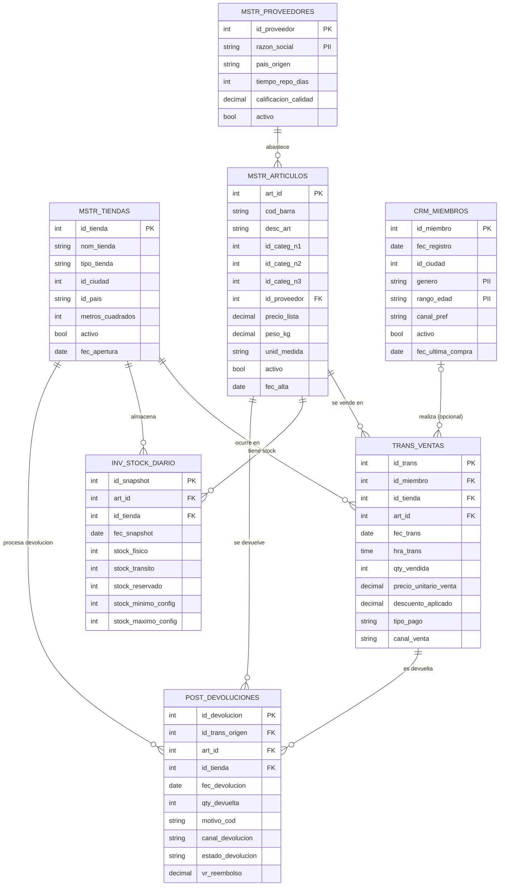

# Diagrama Entidad-Relacion (ER) — RetailMax

> Autogenerado por `docs/gen_er_diagram.py` a partir de
> `data-generation/schemas.py`. Regenerar con `python docs/gen_er_diagram.py`.

## Vista general

## Convenciones

| Etiqueta | Significado |
|---|---|
| `PK`  | Primary Key |
| `FK`  | Foreign Key |
| `PII` | Informacion personal identificable (se enmascara desde Silver) |
| `||--o{`  | Relacion uno a muchos (mandatoria del lado uno) |
| `|o--o{`  | Relacion uno a muchos (opcional) |

## Clasificacion de tablas

### Dimensiones
1. **MSTR_PROVEEDORES** — Proveedores de articulos
2. **MSTR_TIENDAS** — Red de tiendas fisicas
3. **MSTR_ARTICULOS** — Catalogo de SKUs con jerarquia de categorias
4. **CRM_MIEMBROS** — Miembros del programa de fidelizacion

### Hechos
5. **TRANS_VENTAS** — Lineas de venta (grain: una linea por articulo en un ticket)
6. **INV_STOCK_DIARIO** — Snapshots diarios de inventario por (articulo, tienda)
7. **POST_DEVOLUCIONES** — Devoluciones post-venta

## Volumenes

| Tabla | Filas |
|---|---:|
| `MSTR_PROVEEDORES` | 800 |
| `MSTR_TIENDAS` | 150 |
| `MSTR_ARTICULOS` | 5,000 |
| `CRM_MIEMBROS` | 50,000 |
| `TRANS_VENTAS` | 1,000,000 |
| `INV_STOCK_DIARIO` | 750,000 |
| `POST_DEVOLUCIONES` | 50,000 |

## Relaciones

| Origen | Destino | Cardinalidad | Significado |
|---|---|---|---|
| `MSTR_PROVEEDORES` | `MSTR_ARTICULOS` | 1 : N | Un proveedor abastece muchos articulos |
| `MSTR_ARTICULOS` | `TRANS_VENTAS` | 1 : N | Un articulo se vende en muchas transacciones |
| `MSTR_TIENDAS` | `TRANS_VENTAS` | 1 : N | Una tienda registra muchas ventas |
| `CRM_MIEMBROS` | `TRANS_VENTAS` | 0..1 : N | 30% de las ventas son anonimas (id_miembro NULL) |
| `MSTR_ARTICULOS` | `INV_STOCK_DIARIO` | 1 : N | Un articulo tiene un snapshot por (tienda, dia) |
| `MSTR_TIENDAS` | `INV_STOCK_DIARIO` | 1 : N | Una tienda mantiene snapshot de su catalogo cada dia |
| `TRANS_VENTAS` | `POST_DEVOLUCIONES` | 1 : 0..N | Una venta puede generar 0 o mas devoluciones |
| `MSTR_ARTICULOS` | `POST_DEVOLUCIONES` | 1 : N | El articulo devuelto se valida contra el catalogo |
| `MSTR_TIENDAS` | `POST_DEVOLUCIONES` | 1 : N | La tienda que procesa la devolucion |
